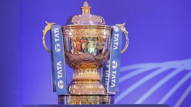

<html>
    <head>
        <title>IPL</title>
        <link rel="stylesheet" href="styles.css">
        <link rel="icon" href="cricket_sport_icon_180212 copy.ico">
    </head>
    <body bgcolor="473cb2">
        <header>
            

                
            

            

                <li class="nav_items">
                    <a href="#home" class="home">Home</a>
                </li>
                <li class="nav_items">
                    <a href="#about" class="about">About</a>
                </li>
                <li class="nav_items">
                    <a href="#stats" class="stats">Stats</a>
                </li>
                <li class="nav_items">
                    <a href="#contacts" class="contacts">Contacts</a>
                </li>
            

        </header>
        <section class="container">
            

                

                    
<h1><b>INDIAN PREMIER LEAGUE</b></h1>
    
                    

<h3>The Indian Premier League (IPL) is a professional men's Twenty20 cricket league, contested by ten teams based out of ten Indian 
                                   cities.  
                           The league was founded by the Board of Control for Cricket in India (BCCI) in 2007.   It is usually held between March and May of every 
                           year and has an exclusive window in the ICC Future Tours Programme.   
                           The IPL is the most-attended cricket league in the world and in 2014 was ranked sixth by average attendance among all sports leagues.  
                           In 2010, the IPL became the first sporting event in the world to be broadcast live on YouTube.  
                           The brand value of the IPL in 2019 was ₹47,500 crore (US$6.2 billion), according to Duff & Phelps.  
                           There have been fourteen seasons of the IPL tournament. The current IPL title holders are the Chennai Super Kings, winning the 2021 season.
                               </h3>
                            

                    

                

                

                     
                    
<i><h4>Tata IPL Trophy</h4></i>

                

            

        </section>
    </body>
</html>
